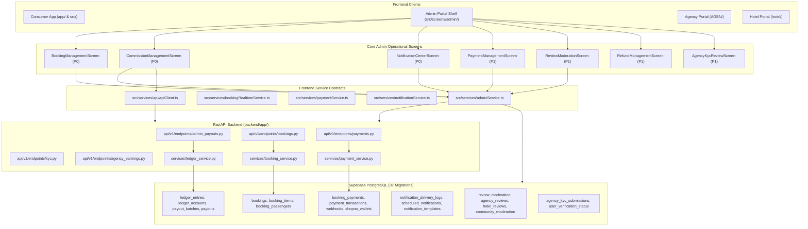

# Dependency Map: ShopnoJatra Architecture

```mermaid
graph TD
    subgraph Frontend["Frontend Clients"]
        App["Consumer App (app/ & src/)"]
        AdminShell["Admin Portal Shell (src/screens/admin/)"]
        AgencyPortal["Agency Portal (AGEN/)"]
        HotelPortal["Hotel Portal (hotel/)"]
    end

    subgraph AdminScreens["Core Admin Operational Screens"]
        BookingOps["BookingManagementScreen (P0)"]
        CommissionOps["CommissionManagementScreen (P0)"]
        NotificationOps["NotificationCenterScreen (P0)"]
        PaymentOps["PaymentManagementScreen (P1)"]
        ReviewOps["ReviewModerationScreen (P1)"]
        RefundOps["RefundManagementScreen (P1)"]
        KycOps["AgencyKycReviewScreen (P1)"]
    end

    subgraph ServiceLayer["Frontend Service Contracts"]
        AdminService["src/services/adminService.ts"]
        BookingService["src/services/bookingRealtimeService.ts"]
        PaymentService["src/services/paymentService.ts"]
        NotificationService["src/services/notificationService.ts"]
        ApiClient["src/services/api/apiClient.ts"]
    end

    subgraph BackendGateway["FastAPI Backend (backend/app/)"]
        AdminPayoutsEp["api/v1/endpoints/admin_payouts.py"]
        BookingsEp["api/v1/endpoints/bookings.py"]
        PaymentsEp["api/v1/endpoints/payments.py"]
        KycEp["api/v1/endpoints/kyc.py"]
        AgencyEarningsEp["api/v1/endpoints/agency_earnings.py"]
        LedgerServicePy["services/ledger_service.py"]
        PaymentServicePy["services/payment_service.py"]
        BookingServicePy["services/booking_service.py"]
    end

    subgraph DatabaseLayer["Supabase PostgreSQL (37 Migrations)"]
        BookingsTable["bookings, booking_items, booking_passengers"]
        LedgerTable["ledger_entries, ledger_accounts, payout_batches, payouts"]
        PaymentTable["booking_payments, payment_transactions, webhooks, shopno_wallets"]
        NotificationTable["notification_delivery_logs, scheduled_notifications, notification_templates"]
        ReviewTable["review_moderation, agency_reviews, hotel_reviews, community_moderation"]
        KycTable["agency_kyc_submissions, user_verification_status"]
    end

    AdminShell --> BookingOps
    AdminShell --> CommissionOps
    AdminShell --> NotificationOps
    AdminShell --> PaymentOps
    AdminShell --> ReviewOps
    AdminShell --> RefundOps
    AdminShell --> KycOps

    BookingOps --> AdminService
    CommissionOps --> AdminService
    CommissionOps --> ApiClient
    NotificationOps --> AdminService
    PaymentOps --> AdminService
    ReviewOps --> AdminService

    AdminService --> BackendGateway
    AdminService --> DatabaseLayer
    ApiClient --> BackendGateway

    AdminPayoutsEp --> LedgerServicePy
    BookingsEp --> BookingServicePy
    PaymentsEp --> PaymentServicePy

    LedgerServicePy --> LedgerTable
    BookingServicePy --> BookingsTable
    PaymentServicePy --> PaymentTable
```
